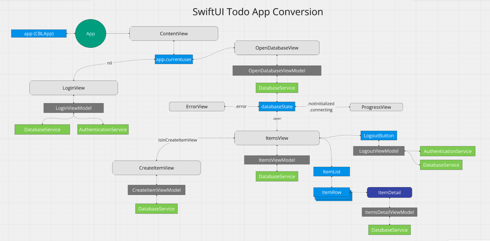

# Conversion Example of MongoDb Atlas Device Sync to Couchbase Lite for SwiftUI Developers
The original version of this [application](https://github.com/mongodb/template-app-swiftui-todo)  was built with the [MongoDb Atlas Device SDK for SwiftUI](https://www.mongodb.com/docs/atlas/device-sdks/sdk/swift/swiftui/) and [Atlas Device Sync](https://www.mongodb.com/docs/atlas/app-services/sync/).  

This repository provides a converted version of the application using [Couchbase Lite for Swift SDK](https://docs.couchbase.com/couchbase-lite/current/swift/gs-prereqs.html) along with [Capella App Services](https://docs.couchbase.com/cloud/app-services/index.html).  

> [!NOTE]
>The original application is a basic To-Do list, and its source code follows a specific approach for implementing a SwiftUI application and managing communication between layers. While the Realm SDK offers a library tailored for SwiftUI, Couchbase Lite provides a Swift SDK. In the original code, many of the Realm interactions were handled directly within the `View`. In this conversion, we’ve moved business logic and state management to a `ViewModel`pattern for a clearer separation of concerns.
>
>This conversion is by no means a best practice for SwiftUI development or a showcase on how to properly communicate between layers of an application.  It's more of an example of some of the process that a developer would have to go through to convert an application from one SDK to another.
>

Some UI changes were made to remove wording about Realm and replaced with Couchbase.

# Requirements
- Xcode 16.0 or later
- iOS 17.0 or later - required by the [Observation](https://developer.apple.com/documentation/observation) framework (`@Observable`) that the ViewModels use
- Couchbase Capella App Services **4.0 or later** - see the warning below
- Basic [SwiftUI](https://developer.apple.com/xcode/swiftui/) knowledge
- Basic [Swift Concurrency](https://docs.swift.org/swift-book/documentation/the-swift-programming-language/concurrency/) knowledge
- Basic [Combine](https://developer.apple.com/documentation/combine) knowledge - Couchbase Lite exposes its reactive APIs as Combine publishers
- Understanding of the [Couchbase Lite SDK for Swift](https://docs.couchbase.com/couchbase-lite/current/swift/quickstart.html)

> [!WARNING]
> This app uses Couchbase Lite **4.1.0**, which negotiates the `BLIP_3+CBMobile_4` replication protocol. Only **App Services / Sync Gateway 4.0 and later** speak that protocol. Pointing this app at a 3.x App Endpoint fails *silently* - the WebSocket upgrade is rejected, no checkpoint is ever established, and the task list stays empty with no error surfaced in the app. 
> If you need to run against a 3.x App Endpoint, use Couchbase Lite 3.3.x instead. Every reactive API described in this document is available from 3.2.3 onwards, so only the version number and the two 4.0 API changes noted below differ.

# Fetching the App Source Code

Clone this repository from GitHub using the command line or your Git client:

```bash
git clone https://github.com/couchbaselabs/cbl-realm-template-app-swiftui-todo.git
```

## Capella Configuration
Before running this application, make sure you have [Couchbase Capella App Services](https://docs.couchbase.com/cloud/get-started/configuring-app-services.html) set up.  
You can find detailed instructions for setting up Couchbase Capella App Services and updating the configuration file in the [Capella.md](./Capella.md) file located in this repository. Be sure to complete these steps before proceeding.

# App Overview
The following diagram shows the flow of the application



# SwiftUI App Conversion 
Several files were changed or added in the conversion process. 

## Package Dependencies 
The app Package Dependencies were updated, removing the Realm and Realm Database frameworks.  The CouchbaseLiteSwift framework was added to the project.  The [Couchbase Lite documentation](https://docs.couchbase.com/couchbase-lite/current/swift/gs-install.html#lbl-install-tabs) covers the various methods for adding the CouchbaseLiteSwift library to a new or existing project.  In this project we used Swift Package Manager (SPM).

The package is pinned with the *Up to Next Minor Version* rule, so the project resolves 4.1.x but will not move to 4.2 on its own:

```
https://github.com/couchbase/couchbase-lite-swift-ee.git
Up to Next Minor Version: 4.1.0
```

> [!WARNING]
> Some XCode users have reported issues restoring the SPM dependencies.  If you have issues, you might need to reset your package cache.  When searching the internet on this problem, most “solutions” on the forums revolve around some magical combination:
> - Cleaning your project (cmd-shift-K)
> - Deleting Xcode’s DerivedData,
> - Deleting Xcode's package.resolve file
> - Running File > Packages > Reset Package Caches
> - Running File > Packages > Resolve Package Versions
> - Closing and re-opening Xcode.
>
> Two failures are specific to changing the SDK version in an existing checkout:
> - If resolution fails with `failed downloading ... already exists in file system`, a partially downloaded artifact is cached. Delete the matching entry under `~/Library/Caches/org.swift.swiftpm/artifacts/` and resolve again.
> - **Do a clean build (cmd-shift-K) after changing the version.** Some signatures changed between releases in ways that are source-compatible but binary-incompatible - `ValueIndexConfiguration.init` is one - and an incremental build can reuse a stale module cache and fail at link time with an undefined symbol.
>

## App Services Configuration File
The original source code had the configuration for Atlas App Services stored in the atlasConfig.plist file located in the App folder.  This file was removed and the configuration for Capella App Services was added in the [capellaConfig.plist](./App/capellaConfig.plist) file. 

The file ships with a placeholder endpoint:

```xml
<key>endpointUrl</key>
<string>wss://&lt;your-endpoint-host&gt;:4984/tasks</string>
```

You will need to replace this placeholder with your own Couchbase Capella App Services endpoint URL, as outlined in the [Capella setup instructions](./Capella.md), before the app can sync.

##  realmSwiftUIApp changes and CBLiteApp
The original source code had the SwiftUI.App [Application](https://github.com/couchbaselabs/cbl-realm-template-app-swiftui-todo/blob/main/App/App.swift#L4) inheriting from a custom realmSwiftUIApp that creates a local RMLApp instance app.

The first major change was to the main app, which was to switch out the global app variable to a new classed called [CBLApp](https://github.com/couchbaselabs/cbl-realm-template-app-swiftui-todo/blob/main/App/Data/CBLApp.swift#L3). 

```swift
let appConfig = loadAppConfig()
let app = CBLApp(configuration: appConfig)

@main
struct todoSwiftUIApp: SwiftUI.App {
  ...
}
```

The local app variable is used to reference features in the Realm SDK, such as authentication and the currently authenticated user. Since this is defined within the Application class, it effectively becomes a global variable for the entire app. This approach requires developers to update most of the code that references the app variable.  To limit the amount of code required to change, the current authenticated user is tracked in CBLApp. 


## Authentication 
The [Couchbase Lite SDK](https://docs.couchbase.com/couchbase-lite/current/android/replication.html#lbl-user-auth)  manages authentication differently than the [Mongo Realm SDK](https://www.mongodb.com/docs/atlas/device-sdks/sdk/kotlin/users/authenticate-users/#std-label-kotlin-authenticate).  Code was added to deal with these differences.   

### Handling Authentication of the App

The authentication of the app is called from a new [AuthenticationService](https://github.com/couchbaselabs/cbl-realm-template-app-swiftui-todo/blob/main/App/Data/AuthenticationService.swift#L13) that was added to the app.

The AuthenticationService handles authentication via the Couchbase Capella App Services Endpoint public [REST API](https://docs.couchbase.com/cloud/app-services/references/rest_api_admin.html) in its login function.  A new LoginViewModel [login function](https://github.com/couchbaselabs/cbl-realm-template-app-swiftui-todo/blob/main/App/ViewModels/LoginViewModel.swift#L19) was added to the application, calling the AuthenticationService and validating that the username and password provided can authenticate with the endpoint (or throwing an exception if they can't).

> [!NOTE]
>Registering new users is out of scope of the conversion, so this functionaliy was removed.  Capella App Services allows the creating of Users per endpoint via the [UI](https://docs.couchbase.com/cloud/app-services/user-management/create-user.html#usermanagement/create-app-role.adoc) or the [REST API](https://docs.couchbase.com/cloud/app-services/references/rest_api_admin.html).  For large scale applications, it's highly recommended to use a 3rd party [OpendID Connect](https://docs.couchbase.com/cloud/app-services/user-management/set-up-authentication-provider.html) provider. 
>

### Authentication Exceptions

Two new exceptions were created to mimic the Realm SDK exceptions for authentication: 
- [ConnectionException](https://github.com/couchbaselabs/cbl-realm-template-app-swiftui-todo/blob/main/App/Data/CBLApp.swift#L14) is thrown if the app can't reach the Capella App Services REST API
- [InvalidCredentialsException](https://github.com/couchbaselabs/cbl-realm-template-app-swiftui-todo/blob/main/App/Data/CBLApp.swift#L18) is thrown if the username or password is incorrect 

### Create User Model

The Couchbase Lite SDK doesn't provide a user object for tracking the authenticated user, so a [new model](https://github.com/couchbaselabs/cbl-realm-template-app-swiftui-todo/blob/main/App/Models/User.swift) was created. 

## Updating Item Domain Model

The [Item](https://github.com/couchbaselabs/cbl-realm-template-app-swiftui-todo/blob/main/App/Models/Item.swift) file was modified to remove the Realm annotations and to refactor some properties to meet standard Swift conventions for serialization.

The Item class supports the Codable and Identifiable protocols, which lets Couchbase Lite read and write it directly - no hand-written JSON conversion and no separate Data Access Object are required.

```swift
class Item: Codable, Identifiable {
    @DocumentID var id: String?
    var isComplete: Bool?
    var summary: String
    var ownerId: String
    ...
}
```

Three details about this class are worth calling out:

- **`@DocumentID`** binds `id` to the document's *metadata* ID rather than to a field in the document body. On save, if `id` is `nil`, Couchbase Lite generates a document ID and writes it back to the property, and the ID is never stored inside the JSON body. On read, the property is populated from the `id` column of the query result - which is why the queries below select `meta().id AS id` explicitly.
- **`Item` has to be a `class`, not a `struct`.** The Codable document APIs (`Collection.save(from:)`, `Collection.delete(for:)`) are constrained to `AnyObject`; the SDK declares `typealias DocumentCodable = Codable & AnyObject`.
- **`isComplete` is optional (`Bool?`).** Swift's generated decoder fails outright if a key for a non-optional property is missing, and because a result set is decoded in a single `data(as:)` call, one document without `isComplete` would fail the whole batch and leave the list empty. Optional lets those documents decode, with `nil` treated as "not complete" where it is displayed.

## Database Service 

A new [DatabaseService](https://github.com/couchbaselabs/cbl-realm-template-app-swiftui-todo/blob/main/App/Data/DatabaseService.swift) was created to handle interactions between the Couchbase Lite Database, Collection, and Replicator and the rest of the application.  

### Logging

The service's initializer turns on console logging:

```swift
init() {
    LogSinks.console = ConsoleLogSink(level: .debug)
}
```

> [!NOTE]
> This is the second API that changed in Couchbase Lite 4.0.  `Database.log` was removed; logging is now configured by assigning a sink to `LogSinks`.  On 3.3.x the equivalent is `Database.log.console.level = .debug`.
>
> Only a console sink is set here, so log output is visible in Xcode while the app runs but is not kept afterwards.  To keep logs for later inspection - which is worth doing when diagnosing replication - also assign a file sink:
> ```swift
> LogSinks.file = FileLogSink(level: .verbose, directory: logDirectory)
> ```

### Initialize Couchbase Lite Database and Replication Configuration

The DatabaseService [ininitializeDatabase](https://github.com/couchbaselabs/cbl-realm-template-app-swiftui-todo/blob/main/App/Data/DatabaseService.swift#L78) function handles the following tasks:

- Initalization of the Database
- Creation of the Collection
- Creation of Indexes
- Creation of Cached Queries
- Setup of the Replicator.  

The following code snippet creates the database file and the `data.tasks` collection.

```swift
 self.database = try Database(name: databaseName)
  if let db = self.database  {
   
  self.taskCollection = try db
    .createCollection(
      name: _taskCollectionName, 
      scope:_scopeName)
  ...
}
```

#### Index Setup 
An index is created to help speed up the query where tasks are filtered out by the ownerId field.  This is done by calling the createIndex method on the collection object.

```swift
//create index
let indexConfig = ValueIndexConfiguration(["ownerId"])
try collection.createIndex(
  withName:"idxTasksOwnerId", 
  config: indexConfig)
```

#### Cached Query Setup 
Next, two basic queries for the application are created:  One to get the current users tasks and one to get all tasks. Queries are compiled when created from the `db.createQuery` function.  By initializing the query when the service is intialized, we can use the query later in the application without having to recompile the query each time the task list is observed. 

```swift
 //create cache queries used for LiveQuery
let selectClause =
  "SELECT meta().id AS id, summary, isComplete, ownerId "
  + "FROM data.tasks "
self.queryAllTasks = try db.createQuery(selectClause)
                    
var queryString = selectClause
queryString.append("WHERE ownerId = '\(user.username)' ")
queryString.append("ORDER BY META().id ASC")
self.queryMyTasks = try db.createQuery(queryString)
```

> [!IMPORTANT]
> The columns are named explicitly rather than using `SELECT *`, and `meta().id AS id` is selected deliberately. A document's ID lives in its metadata, not in its body, so `SELECT *` does not return it and the `@DocumentID` property on `Item` would silently decode as `nil`. Every code path that needs the document ID afterwards - `deleteTask` and `updateItem` both do - would then fail. Naming the columns also means each result row maps straight onto `Item`, with no wrapper object needed to unwrap a `SELECT *` alias.
>

Caching queries aren't required, but can save on resources if the same query is run multiple times. 

#### Replicator Setup 
Next the [Replication Configuration](https://github.com/couchbaselabs/cbl-realm-template-app-swiftui-todo/blob/main/App/Data/DatabaseService.swift#L118) is created using the Endpoint URL that is provided from the resource file described earlier in this document.  The configuration is setup in a [PULL_AND_PUSH](https://docs.couchbase.com/couchbase-lite/current/swift/replication.html#lbl-cfg-sync) configuration which means it will pull changes from the remote database and push changes to Capella App Services. By setting continuous to true the replicator will continue to listen for changes and replicate them.  

```swift
//configure the collection to sync
let collectionConfig = CollectionConfiguration(
  collection: collection)

//create replicator config
var config = ReplicatorConfiguration(
  collections: [collectionConfig], target: targetEndpoint)
config.replicatorType = .pushAndPull
config.continuous = true
```

> [!NOTE]
> This is one of the two APIs that changed in Couchbase Lite 4.0. The collection is now supplied *through* `CollectionConfiguration`, and `ReplicatorConfiguration.collections` is read-only, so collections are passed to the initializer. The 3.x form - `ReplicatorConfiguration(target:)` followed by `config.addCollection(collection, config: CollectionConfiguration())` - was removed. On 3.3.x, use that older form instead.
>

> [!TIP]
>The Couchbase Lite SDK [Replication Configuration](https://docs.couchbase.com/couchbase-lite/current/swift/replication.html#lbl-cfg-repl) API also supports [filtering of channels](https://docs.couchbase.com/couchbase-lite/current/swift/replication.html#lbl-repl-chan) to limit the data that is replicated to the device. 
>

Authentication to App Services is added to  sync information based on the current authenticated user.

```swift
let auth = BasicAuthenticator(
  username: user.username, 
  password: user.password)
config.authenticator = auth
```
#### Replicator Status 
The [Replication Status](https://docs.couchbase.com/couchbase-lite/current/swift/replication.html#lbl-repl-status) is observed through the Replicator's [changePublisher](https://docs.couchbase.com/couchbase-lite/current/swift/reactive.html) - a Combine publisher - and is used to track any errors that might happen. 

```swift
//observe replication status changes
self._replicator?.changePublisher()
  .sink { (change) in
    if let error = change.status.error {
      print("replicator error state \(error)")
    } else {
      print("current state \(change.status.activity)")
    }
  }
  .store(in: &cancellables)
```

`store(in:)` hands the subscription to a `Set<AnyCancellable>` owned by the service, and releasing that set cancels the underlying listener, so there is no token to track:

```swift
//Combine subscriptions owned by this service. `AnyCancellable` cancels its
//subscription when it is released, so there are no listener tokens to remove.
fileprivate var cancellables = Set<AnyCancellable>()
```

Publishers also deliver on the main queue by default, so the `DispatchQueue.main.async` hop that the listener version needed is no longer there.
> [!IMPORTANT]
>Swift Developers should review the [Couchbase Lite SDK documentation for Swift](https://docs.couchbase.com/couchbase-lite/current/swift/replication.html#introduction) prior to making decisions on how to setup the replicator.
>

### addTask function 

The [addTask function](https://github.com/couchbaselabs/cbl-realm-template-app-swiftui-todo/blob/main/App/Data/DatabaseService.swift) was created to add a task to the CouchbaseLite Database using the Codable API.  The method is shown below:

```swift
guard let currentuser = requireCurrentUser() else { return }
guard let collection = taskCollection
else {
  app.setError(InvalidStateError(
    message: "taskCollection is not available."))
  return
}
let task = Item(
  isComplete: false,
  summary: taskSummary,
  ownerId: currentuser.username)

try collection.save(from: task)
```
`requireCurrentUser()` is a small private helper that returns the signed-in `User` or sets an `InvalidCredentialsException` and returns `nil`; it returns the user rather than a `Bool` because each caller needs the `username` as well as the check.  `save(from:)` encodes the object and writes it in a single step. `task.id` is `nil` at this point, so Couchbase Lite generates a document ID and assigns it back to the `@DocumentID` property.  If an error occurs, `app.setError` is called with the exception that was thrown.

### close method

The close method cancels this service's Combine subscriptions, stops replication, and then closes the database.  This will be called when the user logs out from the application making sure if the application is used by multiple uses to close out all resources before another user logs into the application.

```swift
func close() {
 do {
  self.cancellables.removeAll()
  self._replicator?.stop()
  try self.database?.close()
 } catch {
  app.setError(error)
 }
}
```

Releasing the `AnyCancellable` values cancels the query and replicator subscriptions, so the explicit `queryListenerToken?.remove()` and `_replicatorStatusToken?.remove()` calls that the listener-based version required are gone.

### Handling Security of Updates/Delete

In the original app, Realm was handling the security of updates to validate that the current logged in user can update its own tasks, but not other users's task.  When the switch in the application is used to see All Tasks using different subscription, they would have read-only access to the objects.  

Couchbase Lite doesn't have the same security model.  In this application the following approach was taken.  

The code of the application was modified to validate that write access is only allowed by users that own the tasks and the Data Access and Validation script was added in the Capella setup instructions that limits whom can write updates.

Ownership is enforced at three levels:

1. **The UI does not offer the action.** [ItemDetail](https://github.com/couchbaselabs/cbl-realm-template-app-swiftui-todo/blob/main/App/Views/Components/ItemDetail.swift) shows the edit fields and the Save button only when the signed-in user owns the task, and [ItemList](https://github.com/couchbaselabs/cbl-realm-template-app-swiftui-todo/blob/main/App/Views/Components/ItemList.swift) attaches the swipe-to-delete action per row, only for rows the signed-in user owns.
2. **The DatabaseService re-checks before writing.** `deleteTask` and `updateItem` both read the stored document back and compare its `ownerId` against `app.currentUser`, so a call that bypasses the UI is still rejected.
3. **The Data Access and Validation function rejects the write on the server.** See [sync.js](https://github.com/couchbaselabs/cbl-realm-template-app-swiftui-todo/blob/main/sync.js), which is the only one of the three that also applies to clients other than this app.
>

> [!TIP]
> Developers can use a Custom [Replication Conflict Resolution](https://docs.couchbase.com/couchbase-lite/current/android/conflict.html#custom-conflict-resolution) to receive the result in your applications code and then revert the change.
>

### deleteTask method

The deleteTask method removes a task from the database.  The stored document is read back with the `collection.document` function so that its owner can be checked, and that same `Document` is then passed to `collection.delete(document:)`.  A security check was added so that only the owner of the task can delete the task.

```swift
func deleteTask(item: Item) {
  do {
    guard let currentuser = requireCurrentUser() else { return }
    guard let collection = taskCollection
    else {
      app.setError(InvalidStateError(
        message: "taskCollection is not available."))
      return
    }
    guard let documentId = item.id
    else {
      app.setError(InvalidStateError(
        message: "item has not been saved and has no document id"))
      return
    }
    guard let doc = try collection.document(id: documentId)
    else {
      // Already gone - nothing to do, and nothing to report.
      return
    }
    let ownerId = doc.string(forKey: "ownerId")
    if ownerId != currentuser.username {
      throw InvalidStateError(
        message: "document does not belong to current user")
    }
    try collection.delete(document: doc)
  } catch {
    app.setError(error)
  }
}
```

Two details are worth noting:

- `item.id` is an `Optional<String>`, because `@DocumentID` is only populated once an item has been saved or read back from a query. It is unwrapped before use rather than passed straight to `collection.document(id:)`.
- A document that has already been deleted is treated as success rather than as an error. It may have been deleted on another device and that deletion pulled down by replication, in which case the requested end state has already been reached. `delete(document:)` is used rather than the Codable `delete(for:)` for the same reason: the ownership check already holds the `Document`, so no second read is needed, and passing it is idempotent if replication removes the document between the check and the delete. `delete(for:)` fails that race with *"Cannot delete a document that has not yet been saved."*

### Observing the task list with changePublisher

Couchbase Lite doesn't support the various patterns that Realm provides for tracking changes in a Realm.  Instead Couchbase Lite has the [LiveQuery](https://docs.couchbase.com/couchbase-lite/current/swift/query-live.html#activating-a-live-query) API.  A live query is a query that, once activated, remains active and monitors the database for changes; refreshing the result set whenever a change occurs.  Unlike Realm, when a change is detected, the entire query is re-run and the results are updated.

Couchbase Lite has a different way of handing replication and security than the Atlas Device SDK [Subscription API](https://www.mongodb.com/docs/atlas/device-sdks/sdk/kotlin/sync/subscribe/#subscriptions-overview).  Because of this, two queries were created to pull the information from the database based on the users selection.  One query is for all tasks and the other is for the current users tasks.

From release 3.2.3 the SDK exposes live queries as [Combine publishers](https://docs.couchbase.com/couchbase-lite/current/swift/reactive.html), so the DatabaseService no longer owns the observation at all.  It simply returns the appropriate compiled query:

```swift
func tasksQuery(subscriptionType: String) -> Query? {
    subscriptionType == Constants.allItems ? queryAllTasks : queryMyTasks
}
```

The [ItemsViewModel](https://github.com/couchbaselabs/cbl-realm-template-app-swiftui-todo/blob/main/App/ViewModels/ItemsViewModel.swift) subscribes to that query and keeps its `items` array in step with it:

```swift
private func observeTasks(subscriptionType: String) async {
    cancellables.removeAll()

    guard let query = await service.tasksQuery(
        subscriptionType: subscriptionType)
    else { return }

    query.changePublisher()
        .map { change -> [Item] in
            guard let results = change.results else { return [] }
            return (try? results.data(as: Item.self)) ?? []
        }
        .sink { [weak self] items in
            self?.items = items
        }
        .store(in: &cancellables)
}
```

Four details of this subscription are worth calling out:

- **The subscription's lifetime belongs to the ViewModel.**  `store(in:)` puts it into the ViewModel's `Set<AnyCancellable>`, and `cancellables.removeAll()` at the top of the function cancels the previous live query - so toggling between "my tasks" and "all tasks" swaps cleanly instead of leaving two queries running.
- **The ViewModel decides when observation starts and stops.**  Because it holds the cancellable, the DatabaseService does not need to track the observation on its behalf.
- **Decoding is a single call.**  `results.data(as: Item.self)` decodes the whole result set into `[Item]`.
- **Delivery is already on the main queue.**  `changePublisher(on:)` defaults to `.main`.

> [!IMPORTANT]
> The subscription has to be stored.  A Combine publisher does nothing until something subscribes to it, and the subscription is cancelled as soon as its `AnyCancellable` is released - so discarding the result of `sink` means the live query never fires at all.
>

> [!TIP]
> This app subscribes to two of the publishers the SDK offers - the query publisher shown above and `Replicator.changePublisher()` for replication status.  The SDK also provides `Collection.changePublisher()`, `Collection.documentChangePublisher(for:)` and `Replicator.documentReplicationPublisher()`, which are worth considering as the app grows:
>
> - **`documentChangePublisher(for:)`** would make the [ItemDetail](https://github.com/couchbaselabs/cbl-realm-template-app-swiftui-todo/blob/main/App/Views/Components/ItemDetail.swift) view live.  It currently takes a snapshot of the task when it appears, so an edit arriving from another device while the view is open is not reflected until the view is reopened.  Subscribing to changes for that one document ID would keep the open view in step with the database.
> - **`documentReplicationPublisher()`** reports the outcome of each document push or pull, including rejections.  A write that the Sync Function rejects - for example an attempt to modify a task owned by another user - is currently invisible to the app; subscribing would let it surface the failure to the user.
>

> [!IMPORTANT]
>Developers should review the Couchbase Capella App Services [channels](https://docs.couchbase.com/cloud/app-services/channels/channels.html) and [roles](https://docs.couchbase.com/cloud/app-services/user-management/create-app-role.html) documentation to understand the security model it provides prior to planning an application migration. 
>

### updateItem function 
The updateItem function is used to update a task. The stored document is read back so that its owner can be checked, the new values are applied to the `Item`, and the object is written with the Codable `save(from:)` function. A security check was added so that only the owner of the task can update the task.

```swift
guard let currentuser = requireCurrentUser() else { return }
guard let collection = taskCollection
else {
  app.setError(InvalidStateError(
    message: "taskCollection is not available."))
  return
}
guard let documentId = item.id
else {
  app.setError(InvalidStateError(
    message: "item has not been saved and has no document id"))
  return
}
guard let doc = try collection.document(id: documentId)
else {
  app.setError(InvalidStateError(message: "document not found"))
  return
}
let ownerId = doc.string(forKey: "ownerId")
if ownerId != currentuser.username {
  throw InvalidStateError(
    message: "document does not belong to current user")
}
item.isComplete = isComplete
item.summary = summary
try collection.save(from: item)
```

The document is located by `item.id`, which is only populated because the query selects `meta().id AS id`. 
## Other Application Changes

### Rename OpenRealmView 
The [OpenRealmView](https://github.com/mongodb/template-app-swiftui-todo/blob/main/App/Views/OpenRealmView.swift) from the original repo was renamed to [OpenDatabaseView](https://github.com/couchbaselabs/cbl-realm-template-app-swiftui-todo/blob/main/App/Views/OpenDatabaseView.swift#L4).

### Moving UI Components to Components folder
The following UI components were moved to the Components folder inside of the View folder for better organization of the code:
- ItemDetail
- ItemList
- ItemRow
- LogoutButton

### New ViewModels
Several new ViewModels were added to the application to interact between the View and Database Service.  In most cases, state management was moved from the View to the ViewModel.

- [CreateItemViewModel](https://github.com/couchbaselabs/cbl-realm-template-app-swiftui-todo/blob/main/App/ViewModels/CreateItemViewModel.swift) - handles the creation of a new task from the [CreateItemView](https://github.com/couchbaselabs/cbl-realm-template-app-swiftui-todo/blob/main/App/Views/CreateItemView.swift).
- [ItemDetailViewModel](https://github.com/couchbaselabs/cbl-realm-template-app-swiftui-todo/blob/main/App/ViewModels/ItemDetailViewModel.swift) - handles updating a task from the [ItemDetail](https://github.com/couchbaselabs/cbl-realm-template-app-swiftui-todo/blob/main/App/Views/Components/ItemDetail.swift) component.
- [ItemsViewModel](https://github.com/couchbaselabs/cbl-realm-template-app-swiftui-todo/blob/main/App/ViewModels/ItemsViewModel.swift) - handles calling live query for getting the array of task for the [ItemsView](https://github.com/couchbaselabs/cbl-realm-template-app-swiftui-todo/blob/main/App/Views/ItemsView.swift) to render.  It also handles deleting of tasks.
- [LoginViewModel](https://github.com/couchbaselabs/cbl-realm-template-app-swiftui-todo/blob/main/App/ViewModels/LoginViewModel.swift) - handles authenticating of the user from the [LoginView](https://github.com/couchbaselabs/cbl-realm-template-app-swiftui-todo/blob/main/App/Views/LoginView.swift) and calling the initalization of the database.
- [LogoutViewModel](https://github.com/couchbaselabs/cbl-realm-template-app-swiftui-todo/blob/main/App/ViewModels/LogoutViewModel.swift) - handles logging the user out of the application including closing all database resources from the [LogoutButton](https://github.com/couchbaselabs/cbl-realm-template-app-swiftui-todo/blob/main/App/Views/Components/LogoutButton.swift).  
- [OpenDatabaseViewModel](https://github.com/couchbaselabs/cbl-realm-template-app-swiftui-todo/blob/main/App/ViewModels/OpenDatabaseViewModel.swift) - used for stopping and starting replication to simulate the user going offline and online which is done via a button in the [OpenDatabaseView](https://github.com/couchbaselabs/cbl-realm-template-app-swiftui-todo/blob/main/App/Views/OpenDatabaseView.swift#L50). 

#### Observation

All of these ViewModels - along with [CBLApp](https://github.com/couchbaselabs/cbl-realm-template-app-swiftui-todo/blob/main/App/Data/CBLApp.swift) and the `ErrorHandler` in [App.swift](https://github.com/couchbaselabs/cbl-realm-template-app-swiftui-todo/blob/main/App/App.swift) - use the [Observation](https://developer.apple.com/documentation/observation) framework's `@Observable` macro rather than `ObservableObject` with `@Published`:

```swift
@Observable
@MainActor
class ItemsViewModel {
    var items: [Item] = []
    ...
}
```

The Views changed to match: `@StateObject` became `@State`, `@EnvironmentObject` became `@Environment(SomeViewModel.self)`, `.environmentObject(_:)` became `.environment(_:)`, and `@ObservedObject` was dropped where the object is only read.  Because Observation tracks each property individually on any `@Observable` instance a View reads during `body`, reading `app.currentUser` now registers the View for updates without a property wrapper.

Two consequences are worth knowing about:

- **Every type resolved through `@Environment` must be `@Observable`**, even when it holds no mutable state.  `ItemDetailViewModel` and `OpenDatabaseViewModel` only forward a call to the DatabaseService, but `@Environment(ItemDetailViewModel.self)` will not compile unless the type carries the macro.
- **`@Environment` supplies the object but not bindings into it.**  Where a View needs `$viewModel.someProperty` for a `TextField` or `Toggle`, it declares a local `@Bindable` shadow first - which is what `@EnvironmentObject` used to provide directly:

```swift
var body: some View {
    @Bindable var viewModel = viewModel

    return Form {
        TextField("New item", text: $viewModel.itemSummary)
        ...
    }
}
```

> [!NOTE]
> `@Observable` requires iOS 17 or later, which is why this app's deployment target was raised to 17.0.  To support iOS 15 or 16, keep `ObservableObject` with `@Published` instead - the Combine pipeline described above feeds `@Published` properties just as well, and nothing else in this document changes.
>

### Updated ItemDetail view
The ItemDetail view was updated to add a button for saving the task updates that are performed on the view.  The new button calls the ItemDetailViewModel to update the task in the database.

More Information
----------------
- [Couchbase Lite for Swift documentation](https://docs.couchbase.com/couchbase-lite/current/swift/quickstart.html)
- [Couchbase Capella App Services documentation](https://docs.couchbase.com/cloud/app-services/index.html)


Disclaimer
----------
The information provided in this documentation is for general informational purposes only and is provided on an “as-is” basis without any warranties, express or implied. This includes, but is not limited to, warranties of accuracy, completeness, merchantability, or fitness for a particular purpose. The use of this information is at your own risk, and the authors, contributors, or affiliated parties assume no responsibility for any errors or omissions in the content.

No technical support, maintenance, or other services are offered in connection with the use of this information. In no event shall the authors, contributors, or affiliated parties be held liable for any damages, losses, or other liabilities arising out of or in connection with the use or inability to use the information provided.
