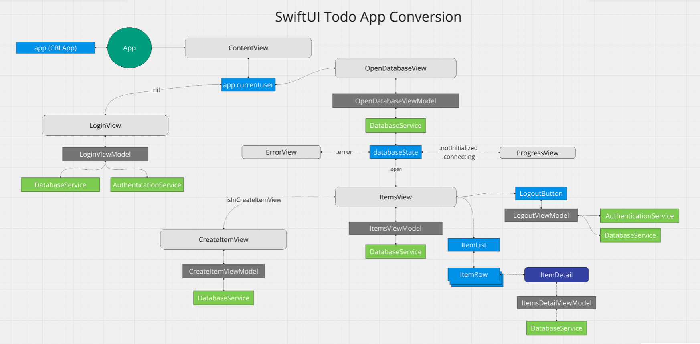

# Conversion Example of MongoDb Atlas Device Sync to Couchbase Lite for SwiftUI Developers 

The original version of this [application](https://github.com/mongodb/template-app-swiftui-todo)  was built with the [MongoDb Atlas Device SDK for SwiftUI](https://www.mongodb.com/docs/atlas/device-sdks/sdk/swift/swiftui/) and [Atlas Device Sync](https://www.mongodb.com/docs/atlas/app-services/sync/).  

This repository provides a converted version of the application using Couchbase Mobile ([Couchbase Lite for Swift SDK](https://docs.couchbase.com/couchbase-lite/current/swift/gs-prereqs.html) along with [Capella App Services](https://docs.couchbase.com/cloud/app-services/index.html).  

> **NOTE**
>The original application is a basic To Do list.  The original source code has it's own opinionated way of implementing an SwiftUI application and communicating between different layers. The Realm SDK provides a very specific library for SwiftUI, while Couchbase Lite provides a Swift SDK.  This conversion is by no means a best practice for SwiftUI development or a show case on how to properly communicate between layers of an application.  It's more of an example of some of the process that a developer would have to go through to convert an application from one SDK to another.
>

Some UI changes were made to remove wording about Realm and replaced with Couchbase.

# App Overview

The following diagram shows the flow of the application



# Capella Configuration

Before running this application, you must have [Couchbase Capella App Services](https://docs.couchbase.com/cloud/get-started/configuring-app-services.html) set up.  Instructions for setting up Couchbase Capella App Services and updating the configuration file can be found in the [Capella.md](./Capella.md) file in this repository.  Please ensure you complete these steps first.

# SwiftUI App Conversion 

Several files were changed or added in the conversion process. 

## Package Dependencies 
The app Package Dependicies were updated, removing the Realm and Realm Database frameworks.  The CouchbaseLiteSwift framework was added to the project.  The [Couchbase Lite documentation](https://docs.couchbase.com/couchbase-lite/current/swift/gs-install.html#lbl-install-tabs) covers the various methods for adding the CouchbaseLiteSwift library to a new or existing project.


## App Services Configuration File

The original source code had the configuration for Atlas App Services stored in the atlasConfig.plist file located in the App folder.  This file was removed and the configuration for Capella App Services was added in the [capellaConfig.plist]() file. 

You will need to modify this file to add your Couchbase Capella App Services endpoint URL, as outlined in the [Capella setup instructions](./Capella.md).

##  realmSwiftUIApp changes and CBLiteApp


The original source code had the SwiftUI.App [Application](https://github.com/couchbaselabs/cbl-realm-template-app-swiftui-todo/blob/main/App/App.swift#L4) inheriting from a custom realmSwiftUIApp that creates a local RMLApp instance app.

The first major change was to the main app, which was to switch out the global app varible to a new classed called [CBLApp](https://github.com/couchbaselabs/cbl-realm-template-app-swiftui-todo/blob/main/App/Data/CBLApp.swift#L3). 

```swift
let appConfig = loadAppConfig()
let app = CBLApp(configuration: appConfig)

@main
struct todoSwiftUIApp: SwiftUI.App {
  ...
}
```

The local app variable is used to reference features in the Realm SDK, such as authentication and the currently authenticated user. Since this is defined within the Application class, it effectively becomes a global variable for the entire app. This approach requires developers to update most of the code that references the app variable. 


## Authentication 

The [Couchbase Lite SDK](https://docs.couchbase.com/couchbase-lite/current/android/replication.html#lbl-user-auth)  manages authentication differently than the [Mongo Realm SDK](https://www.mongodb.com/docs/atlas/device-sdks/sdk/kotlin/users/authenticate-users/#std-label-kotlin-authenticate).  Code was added to deal with these differences.   

### Handling Authencation of the App

The authentication of the app is called from a new [AuthenticationService](https://github.com/couchbaselabs/cbl-realm-template-app-swiftui-todo/blob/main/App/Data/AuthenticationService.swift#L13) that was added to the app to handle authentication.  

Authentication is done via the Couchbase Capella App Services Endpoint public [REST API](https://docs.couchbase.com/cloud/app-services/references/rest_api_admin.html) in the Authentication Service login function, which is called from a new LoginViewModel [login function](https://github.com/couchbaselabs/cbl-realm-template-app-swiftui-todo/blob/main/App/ViewModels/LoginViewModel.swift#L19) that was added to the application, validating that the username and password provided can authenticate with the endpoint (or throwing an exception if they can't).

> [!NOTE]
>Registering new users is out of scope of the conversion, so this functionaliy was removed.  Capella App Services allows the creating of Users per endpoint via the [UI](https://docs.couchbase.com/cloud/app-services/user-management/create-user.html#usermanagement/create-app-role.adoc) or the [REST API](https://docs.couchbase.com/cloud/app-services/references/rest_api_admin.html).  For large scale applications it's highly recommended to use a 3rd party [OpendID Connect](https://docs.couchbase.com/cloud/app-services/user-management/set-up-authentication-provider.html) provider. 
>

### Authentication Exceptions

Two new exceptions were created to mimic the Realm SDK exceptions for authentication: 
- [ConnectionException](https://github.com/couchbaselabs/cbl-realm-template-app-swiftui-todo/blob/main/App/Data/CBLApp.swift#L14) is thrown if the app can't reach the Capella App Services REST API
- [InvalidCredentialsException](https://github.com/couchbaselabs/cbl-realm-template-app-swiftui-todo/blob/main/App/Data/CBLApp.swift#L18) is thrown if the username or password is incorrect 

### Create User Model

The Couchbase Lite SDK doesn't provide a user object for tracking the authenticated user, so a [new model](https://github.com/couchbaselabs/cbl-realm-template-app-swiftui-todo/blob/main/App/Models/User.swift) was created. 

## Updating Item Domain Model

The [Item](https://github.com/couchbaselabs/cbl-realm-template-app-swiftui-todo/blob/main/App/Models/Item.swift#L22) file was modified to remove the Realm annotations and to refactor some properties to meet standard Swift conventions.

The Item class was changed to support the Codable and Identifiable protocols. The Swift serialization library allows the conversion of the class to a JSON string for storage in Couchbase Lite, so changes were made to the class to make it serializable by the Swift serialization library.

Finally, a [ItemDAO](https://github.com/couchbaselabs/cbl-realm-template-app-swiftui-todo/blob/main/App/Models/Item.swift#L3) (Data Access Object) was created to help with the deserialization of the Query Results that come back from a SQL++ QueryChange object.

## Updating Sync Repository

A heavy amount of the conversion code was done in the [SyncRepository](https://github.com/couchbaselabs/cbl-realm-template-app-kotlin-todo/blob/main/app/src/main/java/com/mongodb/app/data/SyncRepository.kt#L26) file.  

### Implementation of DatabaseService

A new [DatabaseService](https://github.com/couchbaselabs/cbl-realm-template-app-kotlin-todo/blob/main/App/Data/DatabaseService.swift#L15) class was added to the Data folder to handle interactions with the Couchbase Lite Database.  

### Initialize Couchbase Lite Database and Replication Configuration

The [DatabaseService ininitializeDatabase function](https://github.com/couchbaselabs/cbl-realm-template-app-swiftui-todo/blob/main/App/Data/DatabaseService.swift#L78) implements the initalization of the Database and the creation of the data.items collection.  

```swift
 self.database = try Database(name: databaseName)
  if let db = self.database  {
   
  self.taskCollection = try db
    .createCollection(
      name: _taskCollectionName, 
      scope:_scopeName)
  ...
}
```

#### Index Setup 
An index is created to help speed up the query where tasks are filtered out by the ownerId field.  This is done by calling the createIndex method on the collection object.

```swift
//create index
let indexConfig = ValueIndexConfiguration(["ownerId"])
try collection.createIndex(
  withName:"idxTasksOwnerId", 
  config: indexConfig)
```

#### Cached Query Setup 
Next, two basic queries for the application are created.  One to get the current users tasks and one to get all tasks. Queries are compiled when created from the `db.createQuery` function.  By initializing the query when the service is intialized, we can use the query later in the application without having to recompile the query each time the setTasksListChangeObserver function is run. 

```swift
 //create cache queries used for LiveQuery
var queryString = "SELECT * FROM data.tasks as item "
self.queryAllTasks = try db.createQuery(queryString)
                    
queryString.append("WHERE item.ownerId = '\(user.username)' ")
queryString.append("ORDER BY META().id ASC")
self.queryMyTasks = try db.createQuery(queryString)
```

Caching queries aren't required, but can save memory and CPU time if the same query is run multiple times. 

#### Replicator Setup 
Next the [Replication Configuration](https://github.com/couchbaselabs/cbl-realm-template-app-swiftui-todo/blob/main/App/Data/DatabaseService.swift#L118) is created using the Endpoint URL that is provided from the resource file described earlier in this document.  The configuration is setup in a [PULL_AND_PUSH](https://docs.couchbase.com/couchbase-lite/current/swift/replication.html#lbl-cfg-sync) configuration which means it will pull changes from the remote database and push changes to Capella App Services. By setting continuous to true the replicator will continue to listen for changes and replicate them.  

```swift
var config = ReplicatorConfiguration(target: targetEndpoint)
config.replicatorType = .pushAndPull
config.continuous = true
```

Authentication is added to only sync information based on the current authenticated user.

```swift
let auth = BasicAuthenticator(
  username: user.username, 
  password: user.password)
config.authenticator = auth
```

#### Replicator Status 
A change listener for [Replication Status](https://docs.couchbase.com/couchbase-lite/current/swift/replication.html#lbl-repl-status) is created and is used to track any errors that might happen. 

```swift
//handle listeners for replication status to calculate
//status change
self._replicatorStatusToken = self._replicator?.addChangeListener 
  ({ (change) in
  DispatchQueue.main.async {
   if let error = change.status.error {
     print("replicator error state \(error)")
   } else {
     print ("current state \(change.status.activity)" )
   }
  }
})
```

> [!NOTE]
>Swift Developers should review the [Couchbase Lite SDK documentation for Swift](https://docs.couchbase.com/couchbase-lite/current/swift/replication.html#introduction) prior to making decisions on how to setup the replicator.
>

### addTask function 

The [addTask method](https://github.com/couchbaselabs/cbl-realm-template-app-swiftui-todo/blob/main/App/Data/DatabaseService.swift#L176) was  implemented to add a task to the CouchbaseLite Database using JSON serialization.  The method is shown below:

```swift
guard let collection = taskCollection
 else {
  app.error = InvalidStateError(
    message: "taskCollection is not available.")
  return
}
let task = Item(
  isComplete: false, 
  summary: taskSummary, 
  ownerId: currentuser.username)
if let json = task.toJSON() {
  let mutableDocument = try MutableDocument(id: task.id, json: json)
  try collection.save(document: mutableDocument)
} else {
  app.error = InvalidStateError(
    message: "item could not be serialized")
}
```

The task is serialized into a JSON string using the Swift serialization library and then saved to the collection via the [MutableDocument](https://docs.couchbase.com/couchbase-lite/current/swift/document.html#create-a-document) object.  If an error occurs, the app.error handler is set with the exception that was thrown.

### close method

The close method is used to remove the Replication Status change listener, stop replication, and then close the database.  This will be called when the user logs out from the application.

```swift
func close() {
 do {
  self.queryListenerToken?.remove()
  self._replicatorStatusToken?.remove()
  self._replicator?.stop()
  try self.database?.close()
 } catch {
  app.error = error
 }
}
```

### Handling Security of Updates/Delete

In the original app, Realm was handling the security of updates to validate that the current logged in user can update its own tasks, but not other users's task.  When the switch in the application is used to see All Tasks using different subscription, they would have read-only access to the objects.  

Couchbase Lite doesn't have the same security model.  Here are two ways to handle this in conversion:

1. Write custom logic in your application to validate that write access is only allowed by users that own the tasks.  This is independant of how the data is syncronized.

2. Allow the write to the database even though the user doesn't have access, and then let the replicator sync the changes.  In the App Services [Access Control and Data Validation](https://docs.couchbase.com/cloud/app-services/deployment/access-control-data-validation.html) [sync function](https://docs.couchbase.com/cloud/app-services/deployment/access-control-data-validation.html), check the security there and then deny the write.  Use a Custom [Replication Conflict Resolution](https://docs.couchbase.com/couchbase-lite/current/android/conflict.html#custom-conflict-resolution) to receive the result in your applications code and then revert the change.

If your app is offline for long periods of time, option 2 might not fit your security requirements. Because this app offers an offline mode, option 1 was selected for the security model in the conversion.

To further harden the security, the App Service sync script could check the ownerId field and use the [requireUser](https://docs.couchbase.com/cloud/app-services/deployment/access-control-data-validation.html#handling-modification) function to deny writes from other users.  This would secure the data from bugs in the application and double validate that writes are only performed by the owner of the task.

In this conversion, the logic of controlling security was done in the DatabaseService class.

### deleteTask method

The deleteTask method removes a task from the database.  This is done by retrieving the document from the database using the `collection.document` function and then calling the collection `delete` function.  A security check was added so that only the owner of the task can delete the task.

```swift
//todo add code example
```


### setTasksListChangeObserver function 

Couchbase Lite doesn't support the various patterns that Realm provides for tracking changes in a Realm.  Instead Couchbase Lite has an API called [LiveQuery](https://docs.couchbase.com/couchbase-lite/current/swift/query-live.html#activating-a-live-query)

Couchbase Lite has a different way of handing replication and security than the Atlas Device SDK [Subscription API](https://www.mongodb.com/docs/atlas/device-sdks/sdk/kotlin/sync/subscribe/#subscriptions-overview).  Because of this, some of the code has been changed to handle when filtering out the current user tasks vs all tasks in the collection.

> [!IMPORTANT]
>For a production mobile app, make sure you read the Couchbase Capella App Services [channels](https://docs.couchbase.com/cloud/app-services/channels/channels.html) and [roles](https://docs.couchbase.com/cloud/app-services/user-management/create-app-role.html) documentation to understand the security model it provides. 
>
>The Couchbase Lite SDK [Replication Configuration](https://docs.couchbase.com/couchbase-lite/current/swift/replication.html#lbl-cfg-repl) API also supports [filtering of channels](https://docs.couchbase.com/couchbase-lite/current/swift/replication.html#lbl-repl-chan) to limit the data that is replicated to the device. 

### TODO Finish the documenation

More Information
----------------
- [Couchbase Lite for Android documentation](https://docs.couchbase.com/couchbase-lite/current/android/quickstart.html)
- [Couchbase Capella App Services documentation](https://docs.couchbase.com/cloud/app-services/index.html)


Disclaimer
----------
The information provided in this documentation is for general informational purposes only and is provided on an “as-is” basis without any warranties, express or implied. This includes, but is not limited to, warranties of accuracy, completeness, merchantability, or fitness for a particular purpose. The use of this information is at your own risk, and the authors, contributors, or affiliated parties assume no responsibility for any errors or omissions in the content.

No technical support, maintenance, or other services are offered in connection with the use of this information. In no event shall the authors, contributors, or affiliated parties be held liable for any damages, losses, or other liabilities arising out of or in connection with the use or inability to use the information provided.
